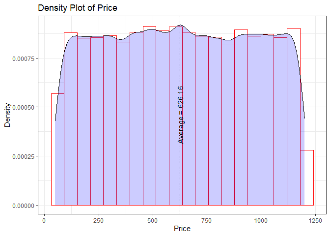
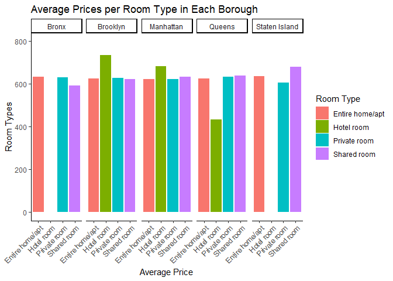
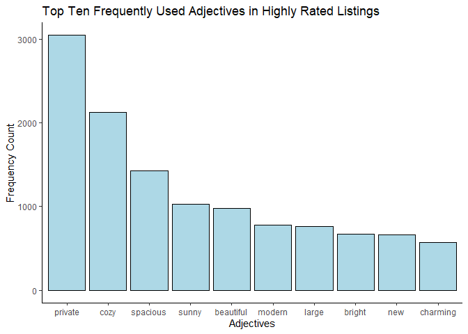

Airbnb Data Analysis
================
Kalsang Sherpa

### Required Packages :

``` r
library(knitr)
library(tidyverse)
library(tidytext)
library(geomtextpath)
library(wordcloud)
library(RColorBrewer)
library(tm)
```

### Data Importing :

``` r
dat <- read_csv("Airbnb_Open_Data.csv")

# view first couple rows
kable(head(dat))
```

|      id | NAME                                             |     host id | host_identity_verified | host name | neighbourhood group | neighbourhood |      lat |      long | country       | country code | instant_bookable | cancellation_policy | room type       | Construction year | price | service fee | minimum nights | number of reviews | last review | reviews per month | review rate number | calculated host listings count | availability 365 | house_rules                                                                                                                                                                                                                                                                                                                                                                                                         | license |
|--------:|:-------------------------------------------------|------------:|:-----------------------|:----------|:--------------------|:--------------|---------:|----------:|:--------------|:-------------|:-----------------|:--------------------|:----------------|------------------:|:------|:------------|---------------:|------------------:|:------------|------------------:|-------------------:|-------------------------------:|-----------------:|:--------------------------------------------------------------------------------------------------------------------------------------------------------------------------------------------------------------------------------------------------------------------------------------------------------------------------------------------------------------------------------------------------------------------|:--------|
| 1001254 | Clean & quiet apt home by the park               | 80014485718 | unconfirmed            | Madaline  | Brooklyn            | Kensington    | 40.64749 | -73.97237 | United States | US           | FALSE            | strict              | Private room    |              2020 | \$966 | \$193       |             10 |                 9 | 10/19/2021  |              0.21 |                  4 |                              6 |              286 | Clean up and treat the home the way you’d like your home to be treated. No smoking.                                                                                                                                                                                                                                                                                                                                 | NA      |
| 1002102 | Skylit Midtown Castle                            | 52335172823 | verified               | Jenna     | Manhattan           | Midtown       | 40.75362 | -73.98377 | United States | US           | FALSE            | moderate            | Entire home/apt |              2007 | \$142 | \$28        |             30 |                45 | 5/21/2022   |              0.38 |                  4 |                              2 |              228 | Pet friendly but please confirm with me if the pet you are planning on bringing with you is OK. I have a cute and quiet mixed chihuahua. I could accept more guests (for an extra fee) but this also needs to be confirmed beforehand. Also friends traveling together could sleep in separate beds for an extra fee (the second bed is either a sofa bed or inflatable bed). Smoking is only allowed on the porch. | NA      |
| 1002403 | THE VILLAGE OF HARLEM….NEW YORK !                | 78829239556 | NA                     | Elise     | Manhattan           | Harlem        | 40.80902 | -73.94190 | United States | US           | TRUE             | flexible            | Private room    |              2005 | \$620 | \$124       |              3 |                 0 | NA          |                NA |                  5 |                              1 |              352 | I encourage you to use my kitchen, cooking and laundry facilities. There is no additional charge to use the washer/dryer in the basement. No smoking, inside or outside. Come home as late as you want. If you come home stumbling drunk, it’s OK the first time. If you do it again, and you wake up me or the neighbors downstairs, we will be annoyed. (Just so you know . . . )                                 | NA      |
| 1002755 | NA                                               | 85098326012 | unconfirmed            | Garry     | Brooklyn            | Clinton Hill  | 40.68514 | -73.95976 | United States | US           | TRUE             | moderate            | Entire home/apt |              2005 | \$368 | \$74        |             30 |               270 | 7/5/2019    |              4.64 |                  4 |                              1 |              322 | NA                                                                                                                                                                                                                                                                                                                                                                                                                  | NA      |
| 1003689 | Entire Apt: Spacious Studio/Loft by central park | 92037596077 | verified               | Lyndon    | Manhattan           | East Harlem   | 40.79851 | -73.94399 | United States | US           | FALSE            | moderate            | Entire home/apt |              2009 | \$204 | \$41        |             10 |                 9 | 11/19/2018  |              0.10 |                  3 |                              1 |              289 | Please no smoking in the house, porch or on the property (you can go to the nearby corner). Reasonable quiet after 10:30 pm. Please remove shoes in the house.                                                                                                                                                                                                                                                      | NA      |
| 1004098 | Large Cozy 1 BR Apartment In Midtown East        | 45498551794 | verified               | Michelle  | Manhattan           | Murray Hill   | 40.74767 | -73.97500 | United States | US           | TRUE             | flexible            | Entire home/apt |              2013 | \$577 | \$115       |              3 |                74 | 6/22/2019   |              0.59 |                  3 |                              1 |              374 | No smoking, please, and no drugs.                                                                                                                                                                                                                                                                                                                                                                                   | NA      |

``` r
summary(dat)
```

    ##        id               NAME              host id         
    ##  Min.   : 1001254   Length:102599      Min.   :1.236e+08  
    ##  1st Qu.:15085814   Class :character   1st Qu.:2.458e+10  
    ##  Median :29136603   Mode  :character   Median :4.912e+10  
    ##  Mean   :29146235                      Mean   :4.925e+10  
    ##  3rd Qu.:43201198                      3rd Qu.:7.400e+10  
    ##  Max.   :57367417                      Max.   :9.876e+10  
    ##                                                           
    ##  host_identity_verified  host name         neighbourhood group
    ##  Length:102599          Length:102599      Length:102599      
    ##  Class :character       Class :character   Class :character   
    ##  Mode  :character       Mode  :character   Mode  :character   
    ##                                                               
    ##                                                               
    ##                                                               
    ##                                                               
    ##  neighbourhood           lat             long          country         
    ##  Length:102599      Min.   :40.50   Min.   :-74.25   Length:102599     
    ##  Class :character   1st Qu.:40.69   1st Qu.:-73.98   Class :character  
    ##  Mode  :character   Median :40.72   Median :-73.95   Mode  :character  
    ##                     Mean   :40.73   Mean   :-73.95                     
    ##                     3rd Qu.:40.76   3rd Qu.:-73.93                     
    ##                     Max.   :40.92   Max.   :-73.71                     
    ##                     NA's   :8       NA's   :8                          
    ##  country code       instant_bookable cancellation_policy  room type        
    ##  Length:102599      Mode :logical    Length:102599       Length:102599     
    ##  Class :character   FALSE:51474      Class :character    Class :character  
    ##  Mode  :character   TRUE :51020      Mode  :character    Mode  :character  
    ##                     NA's :105                                              
    ##                                                                            
    ##                                                                            
    ##                                                                            
    ##  Construction year    price           service fee        minimum nights     
    ##  Min.   :2003      Length:102599      Length:102599      Min.   :-1223.000  
    ##  1st Qu.:2007      Class :character   Class :character   1st Qu.:    2.000  
    ##  Median :2012      Mode  :character   Mode  :character   Median :    3.000  
    ##  Mean   :2012                                            Mean   :    8.136  
    ##  3rd Qu.:2017                                            3rd Qu.:    5.000  
    ##  Max.   :2022                                            Max.   : 5645.000  
    ##  NA's   :214                                             NA's   :409        
    ##  number of reviews last review        reviews per month review rate number
    ##  Min.   :   0.00   Length:102599      Min.   : 0.010    Min.   :1.000     
    ##  1st Qu.:   1.00   Class :character   1st Qu.: 0.220    1st Qu.:2.000     
    ##  Median :   7.00   Mode  :character   Median : 0.740    Median :3.000     
    ##  Mean   :  27.48                      Mean   : 1.374    Mean   :3.279     
    ##  3rd Qu.:  30.00                      3rd Qu.: 2.000    3rd Qu.:4.000     
    ##  Max.   :1024.00                      Max.   :90.000    Max.   :5.000     
    ##  NA's   :183                          NA's   :15879     NA's   :326       
    ##  calculated host listings count availability 365 house_rules       
    ##  Min.   :  1.000                Min.   : -10.0   Length:102599     
    ##  1st Qu.:  1.000                1st Qu.:   3.0   Class :character  
    ##  Median :  1.000                Median :  96.0   Mode  :character  
    ##  Mean   :  7.937                Mean   : 141.1                     
    ##  3rd Qu.:  2.000                3rd Qu.: 269.0                     
    ##  Max.   :332.000                Max.   :3677.0                     
    ##  NA's   :319                    NA's   :448                        
    ##  license       
    ##  Mode:logical  
    ##  NA's:102599   
    ##                
    ##                
    ##                
    ##                
    ## 

``` r
# Look for missing values
sum(is.na(dat))
```

    ## [1] 190770

``` r
colSums(is.na(dat))
```

    ##                             id                           NAME 
    ##                              0                            249 
    ##                        host id         host_identity_verified 
    ##                              0                            289 
    ##                      host name            neighbourhood group 
    ##                            406                             29 
    ##                  neighbourhood                            lat 
    ##                             16                              8 
    ##                           long                        country 
    ##                              8                            532 
    ##                   country code               instant_bookable 
    ##                            131                            105 
    ##            cancellation_policy                      room type 
    ##                             76                              0 
    ##              Construction year                          price 
    ##                            214                            247 
    ##                    service fee                 minimum nights 
    ##                            273                            409 
    ##              number of reviews                    last review 
    ##                            183                          15893 
    ##              reviews per month             review rate number 
    ##                          15879                            326 
    ## calculated host listings count               availability 365 
    ##                            319                            448 
    ##                    house_rules                        license 
    ##                          52131                         102599

### Data Cleaning :

Some of the column names aren’t consistent. Therefore, in order to
follow the same naming rules we changed all column names to lowercase
and added an underscore in between words.

``` r
# Fix column names to have consistency
header <- colnames(dat)
header
```

    ##  [1] "id"                             "NAME"                          
    ##  [3] "host id"                        "host_identity_verified"        
    ##  [5] "host name"                      "neighbourhood group"           
    ##  [7] "neighbourhood"                  "lat"                           
    ##  [9] "long"                           "country"                       
    ## [11] "country code"                   "instant_bookable"              
    ## [13] "cancellation_policy"            "room type"                     
    ## [15] "Construction year"              "price"                         
    ## [17] "service fee"                    "minimum nights"                
    ## [19] "number of reviews"              "last review"                   
    ## [21] "reviews per month"              "review rate number"            
    ## [23] "calculated host listings count" "availability 365"              
    ## [25] "house_rules"                    "license"

``` r
header <- tolower(header)
header <- str_replace_all(header, " ", "_")
colnames(dat) <- header # new column names

glimpse(dat)
```

    ## Rows: 102,599
    ## Columns: 26
    ## $ id                             <dbl> 1001254, 1002102, 1002403, 1002755, 100…
    ## $ name                           <chr> "Clean & quiet apt home by the park", "…
    ## $ host_id                        <dbl> 80014485718, 52335172823, 78829239556, …
    ## $ host_identity_verified         <chr> "unconfirmed", "verified", NA, "unconfi…
    ## $ host_name                      <chr> "Madaline", "Jenna", "Elise", "Garry", …
    ## $ neighbourhood_group            <chr> "Brooklyn", "Manhattan", "Manhattan", "…
    ## $ neighbourhood                  <chr> "Kensington", "Midtown", "Harlem", "Cli…
    ## $ lat                            <dbl> 40.64749, 40.75362, 40.80902, 40.68514,…
    ## $ long                           <dbl> -73.97237, -73.98377, -73.94190, -73.95…
    ## $ country                        <chr> "United States", "United States", "Unit…
    ## $ country_code                   <chr> "US", "US", "US", "US", "US", "US", "US…
    ## $ instant_bookable               <lgl> FALSE, FALSE, TRUE, TRUE, FALSE, TRUE, …
    ## $ cancellation_policy            <chr> "strict", "moderate", "flexible", "mode…
    ## $ room_type                      <chr> "Private room", "Entire home/apt", "Pri…
    ## $ construction_year              <dbl> 2020, 2007, 2005, 2005, 2009, 2013, 201…
    ## $ price                          <chr> "$966", "$142", "$620", "$368", "$204",…
    ## $ service_fee                    <chr> "$193", "$28", "$124", "$74", "$41", "$…
    ## $ minimum_nights                 <dbl> 10, 30, 3, 30, 10, 3, 45, 45, 2, 2, 1, …
    ## $ number_of_reviews              <dbl> 9, 45, 0, 270, 9, 74, 49, 49, 430, 118,…
    ## $ last_review                    <chr> "10/19/2021", "5/21/2022", NA, "7/5/201…
    ## $ reviews_per_month              <dbl> 0.21, 0.38, NA, 4.64, 0.10, 0.59, 0.40,…
    ## $ review_rate_number             <dbl> 4, 4, 5, 4, 3, 3, 5, 5, 3, 5, 3, 4, 4, …
    ## $ calculated_host_listings_count <dbl> 6, 2, 1, 1, 1, 1, 1, 1, 1, 1, 4, 1, 1, …
    ## $ availability_365               <dbl> 286, 228, 352, 322, 289, 374, 224, 219,…
    ## $ house_rules                    <chr> "Clean up and treat the home the way yo…
    ## $ license                        <lgl> NA, NA, NA, NA, NA, NA, NA, NA, NA, NA,…

Looking at the two columns ‘license’ and ‘house_rules’, we can see that
license is completely missing (100% missing data) and house_rules is
missing 52,1331 observations (50.81% missing). Drawing the line at 50%
we plan to remove anything over 50% missing, since having half the data
missing is not favorable for imputation. We also removed ‘country’ and
‘country_code’ since all the data is from only NYC. Lastly, we removed
latitude and longitude since our data is all in NYC and doesn’t require
those measurements to locate them.

``` r
# Remove license and house rules from data set
dat <- dat %>% 
  select(-license, -house_rules) %>%
  select(-country, -country_code) %>%
  select(-lat, -long)
```

We drop categorical variables that we would have trouble imputing. We
also dropped non-numeric variables such as name and host_name that would
not be imputable.

``` r
dat <- dat %>%
  drop_na(instant_bookable, name, host_identity_verified, host_name, cancellation_policy)
```

Looking at the proportion of different neighborhood groups, we can see
that there is one observation for both Manhattan and Brooklyn that is
spelled incorreclty, therefore, we add it to the correct neighborhood
group. We also have 18 missing values in neighborhood group that we
elect to drop since there is not reasonable way to impute it, as well as
14 missing neighborhood values.

``` r
table(dat$neighbourhood_group)
```

    ## 
    ##         Bronx       brookln      Brooklyn     Manhattan        Queens 
    ##          2687             1         41406         43370         13157 
    ## Staten Island 
    ##           943

``` r
sum(is.na(dat$neighbourhood_group))
```

    ## [1] 18

``` r
dat <- dat %>% 
  # Correct the spelling of neighbourhood groups
  mutate(neighbourhood_group = if_else(neighbourhood_group == "brookln", "Brooklyn", neighbourhood_group))%>%
  mutate(neighbourhood_group = if_else(neighbourhood_group == "manhatan", "Manhattan", neighbourhood_group)) %>%
  # Drop the rows where neighborhood group isn't listed.
  drop_na(neighbourhood_group)

# Remove missing neighbourhood values.
sum(is.na(dat$neighbourhood))
```

    ## [1] 14

``` r
dat <- drop_na(dat, neighbourhood)
```

Here we first change price and service fee to numerics, then impute the
missing values based on the neighborhood averages.

``` r
# Change data type of 'price'
dat$price <- gsub(",", "", dat$price)
dat$price <- gsub("\\$", "", dat$price)
dat$price <- as.numeric(dat$price)

# Change data type of 'service_fee'
dat$service_fee <- gsub(",", "", dat$service_fee)
dat$service_fee <- gsub("\\$", "", dat$service_fee)
dat$service_fee <- as.numeric(dat$service_fee)


# Impute missing price with the average price for that neighbourhood group.
dat <- dat %>%
  group_by(neighbourhood_group) %>%
  mutate(price = ifelse(is.na(price), round(mean(price, na.rm = T)), price)) %>%
  # since service fee is dependent on price, we will also change the service fee based on neighbourhood group.
  mutate(service_fee = ifelse(is.na(service_fee), round(mean(service_fee, na.rm = T)), service_fee))
```

Lastly, looking at the remaining missing values, we just removed the
remaining ones since we don’t plan on imputing them. By doing this we
dropped 16.56% of our data.

``` r
colSums(is.na(dat))
```

    ##                             id                           name 
    ##                              0                              0 
    ##                        host_id         host_identity_verified 
    ##                              0                              0 
    ##                      host_name            neighbourhood_group 
    ##                              0                              0 
    ##                  neighbourhood               instant_bookable 
    ##                              0                              0 
    ##            cancellation_policy                      room_type 
    ##                              0                              0 
    ##              construction_year                          price 
    ##                            183                              0 
    ##                    service_fee                 minimum_nights 
    ##                              0                            388 
    ##              number_of_reviews                    last_review 
    ##                            182                          15724 
    ##              reviews_per_month             review_rate_number 
    ##                          15713                            290 
    ## calculated_host_listings_count               availability_365 
    ##                            310                            401

``` r
pre <- nrow(dat)
# Remove all of the remaining NA's
dat <- na.omit(dat)

print(paste("By dropping the remaining missing values, we have dropped", pre - nrow(dat), "observations.", sep =" "))
```

    ## [1] "By dropping the remaining missing values, we have dropped 16823 observations."

### Data Analysis

About 70,282 listings (82.95%) were located in Brooklyn or Manhattan.
The highest average price by borough was Queens, coming in at \$630.56 a
night. When we break down the listings by borough and by room type we
can see that the different room types that were listed in each borough.

``` r
by_neigh <- dat %>%
  group_by(neighbourhood_group) %>%
  summarise(listings = n(), average_price = mean(price)) %>%
  arrange(desc(listings))
kable(by_neigh)
```

| neighbourhood_group | listings | average_price |
|:--------------------|---------:|--------------:|
| Brooklyn            |    35154 |      627.5436 |
| Manhattan           |    35128 |      623.1754 |
| Queens              |    11301 |      630.5613 |
| Bronx               |     2310 |      630.2156 |
| Staten Island       |      834 |      622.4712 |

``` r
neigh_roomtype <- dat %>% 
  group_by(neighbourhood_group, room_type) %>%
  summarise(listings = n(), average_price = mean(price))
```

    ## `summarise()` has grouped output by 'neighbourhood_group'. You can override
    ## using the `.groups` argument.

``` r
kable(neigh_roomtype)
```

| neighbourhood_group | room_type       | listings | average_price |
|:--------------------|:----------------|---------:|--------------:|
| Bronx               | Entire home/apt |      881 |      633.3882 |
| Bronx               | Private room    |     1339 |      630.6012 |
| Bronx               | Shared room     |       90 |      593.4222 |
| Brooklyn            | Entire home/apt |    18005 |      626.0349 |
| Brooklyn            | Hotel room      |        8 |      736.1250 |
| Brooklyn            | Private room    |    16527 |      629.2936 |
| Brooklyn            | Shared room     |      614 |      623.2622 |
| Manhattan           | Entire home/apt |    21008 |      622.6427 |
| Manhattan           | Hotel room      |       98 |      684.5306 |
| Manhattan           | Private room    |    13332 |      622.9842 |
| Manhattan           | Shared room     |      690 |      634.3754 |
| Queens              | Entire home/apt |     4520 |      624.4985 |
| Queens              | Hotel room      |        8 |      433.2500 |
| Queens              | Private room    |     6488 |      634.6104 |
| Queens              | Shared room     |      285 |      640.0772 |
| Staten Island       | Entire home/apt |      423 |      636.0095 |
| Staten Island       | Private room    |      404 |      607.2847 |
| Staten Island       | Shared room     |        7 |      680.8571 |

Looking at the density and distribution of listing prices. Price is
distributed uniformly.

``` r
ggplot(dat, aes(x = price)) +
  geom_histogram(aes(y = ..density..), bins = 20, colour = "red", fill = "white") +
  labs(title = "Density Plot of Price",
       x = "Price",
       y = "Density") +
  geom_density(alpha = .2, fill = "blue") +
  theme_bw()
```

    ## Warning: The dot-dot notation (`..density..`) was deprecated in ggplot2 3.4.0.
    ## ℹ Please use `after_stat(density)` instead.

<!-- -->

Look at the prices of different room types in each borough.

``` r
ggplot(neigh_roomtype, aes(x = room_type, y = average_price, group = room_type)) +
  geom_col(aes(stat = "identity", fill = room_type))  + 
  scale_y_continuous(limits = c(0, 800)) +
  labs(title = "Average Prices per Room Type in Each Borough",
       x = "Average Price",
       y = "Room Types",
       fill = "Room Type") +
  theme_classic() +
  theme(axis.text.x = element_text(angle = 45, hjust = 1, vjust = 1)) +
  facet_grid(. ~ neighbourhood_group)
```

    ## Warning in geom_col(aes(stat = "identity", fill = room_type)): Ignoring unknown
    ## aesthetics: stat

<!-- -->

Check the distribution of review ratings.

``` r
avg_rating <- round(mean(dat$review_rate_number), digits = 2)
ggplot(dat, aes(x = review_rate_number)) +
  geom_histogram(binwidth = 1, color = "blue", fill = "grey") +
  labs(title = "Distribution of Review Scores",
       x = "Rating",
       y = "Count") +
  geom_textvline(xintercept = avg_rating, linetype = "dotdash", label = paste("Average = ", avg_rating, sep = "")) +
  theme_minimal()
```

<!-- -->

Visualize the top ten average review ratings based on neighbourhoods. In
order to qualify, neighbourhood must have at least 50 listings.

``` r
# Find top ten neighborhoods in terms of reviews.
top_ten <- dat %>%
  group_by(neighbourhood_group, neighbourhood) %>%
  summarise(listings = n(), avg_rating = mean(review_rate_number)) %>%
  arrange(desc(avg_rating)) %>%
  # Set threshold to at least 50 listings.
  filter(listings > 50) 
```

    ## `summarise()` has grouped output by 'neighbourhood_group'. You can override
    ## using the `.groups` argument.

``` r
# get the first 10. 
top_ten <- top_ten[1:10,]
top_ten$neighbourhood <- factor(top_ten$neighbourhood, levels = top_ten$neighbourhood[order(top_ten$avg_rating, decreasing = TRUE)])


ggplot(top_ten, aes(x = neighbourhood, y = avg_rating, group = neighbourhood_group)) +
  geom_col(aes(stat = "identity", fill = top_ten$neighbourhood_group), color = "lightblue") +
  labs(title = "Top Ten Rated Neighborhoods",
       x = "Neighborhood",
       y = "Rating",
       fill = "Borough",
       caption = "50 listings in neighborhood or greater required to qualify") +
  geom_text(label = round(top_ten$avg_rating, digits = 2), position = position_dodge(0.9), vjust = -0.2) +
  theme_bw() +
  theme(axis.text.x = element_text(angle = 45, hjust = 1, vjust = 1),
        plot.caption = element_text(hjust = 0))
```

    ## Warning in geom_col(aes(stat = "identity", fill =
    ## top_ten$neighbourhood_group), : Ignoring unknown aesthetics: stat

<!-- -->

Look at the differences in reviews between different cancellation
policies.

``` r
prop.table(table(dat$cancellation_policy))
```

    ## 
    ##  flexible  moderate    strict 
    ## 0.3320547 0.3350526 0.3328927

``` r
# Check to see review by different cancellation policies.
by_policy <- dat %>%
  group_by(cancellation_policy) %>%
  summarise(average_review = mean(review_rate_number))
by_policy
```

<div data-pagedtable="false">

<script data-pagedtable-source type="application/json">
{"columns":[{"label":["cancellation_policy"],"name":[1],"type":["chr"],"align":["left"]},{"label":["average_review"],"name":[2],"type":["dbl"],"align":["right"]}],"data":[{"1":"flexible","2":"3.281119"},{"1":"moderate","2":"3.281351"},{"1":"strict","2":"3.278036"}],"options":{"columns":{"min":{},"max":[10]},"rows":{"min":[10],"max":[10]},"pages":{}}}
  </script>

</div>

View average review ratings by borough.

``` r
# View review by boroughs. 
borough_review <- dat %>%
  group_by(neighbourhood_group) %>%
  summarise(avg_review = mean(review_rate_number))

ggplot(borough_review, aes(x = neighbourhood_group, y = avg_review)) +
  geom_col(aes(stat = "identity"), color = "red") +
  geom_text(label = round(borough_review$avg_review, digits = 2), position = position_dodge(0.9), vjust = -0.5) +
  labs(title = "Average Review Ratings by Boroughs", x = "Borough", y = "Rating") +
  theme_classic()
```

<!-- -->

Looking at frequently used adjectives in listings that were rated 4 and
5 stars.

``` r
# Get 4 and 5 star reviews.
highreviews.dat <- dat %>%
  filter(review_rate_number > 4 | review_rate_number >5)
highreviews.dat <- tibble(highreviews.dat[,2])

txt <- highreviews.dat$name
corp.dat <- Corpus(VectorSource(txt))

# Clean up the text. 
corp.dat <- corp.dat %>%
  tm_map(removePunctuation) %>%
  tm_map(removeNumbers) %>%
  tm_map(stripWhitespace) %>%
  tm_map(removeWords, stopwords("english"))

tdm.dat <- TermDocumentMatrix(corp.dat)
matrix <- as.matrix(tdm.dat)
results <- sort(rowSums(matrix), decreasing = TRUE)

df.dat <- data.frame(word = names(results), freq = results)


# Store only adjectives
df.dat <- df.dat %>% 
  left_join(parts_of_speech) %>%
  filter(pos %in% "Adjective")
```

    ## Joining, by = "word"

``` r
head(df.dat)
```

<div data-pagedtable="false">

<script data-pagedtable-source type="application/json">
{"columns":[{"label":[""],"name":["_rn_"],"type":[""],"align":["left"]},{"label":["word"],"name":[1],"type":["chr"],"align":["left"]},{"label":["freq"],"name":[2],"type":["dbl"],"align":["right"]},{"label":["pos"],"name":[3],"type":["chr"],"align":["left"]}],"data":[{"1":"private","2":"3048","3":"Adjective","_rn_":"1"},{"1":"cozy","2":"2125","3":"Adjective","_rn_":"2"},{"1":"apt","2":"1740","3":"Adjective","_rn_":"3"},{"1":"spacious","2":"1432","3":"Adjective","_rn_":"4"},{"1":"east","2":"1121","3":"Adjective","_rn_":"5"},{"1":"sunny","2":"1030","3":"Adjective","_rn_":"6"}],"options":{"columns":{"min":{},"max":[10]},"rows":{"min":[10],"max":[10]},"pages":{}}}
  </script>

</div>

``` r
# Manually remove some words
df.dat <- df.dat[c(-3, -5, -8, -11, -15, -16),]

# Create word cloud
set.seed(3005)
wordcloud(words = df.dat$word, freq = df.dat$freq, min.freq = 50, random.order = FALSE, colors = brewer.pal(9, 'Set1'))
```

<!-- -->

``` r
top_ten <- df.dat[1:10,]
top_ten$word <- factor(top_ten$word, levels = top_ten$word[order(top_ten$freq, decreasing = TRUE)])
ggplot(top_ten, aes(x = word, y = freq)) +
  geom_col(aes(stat = "identity"), fill = "lightblue", color = "black") +
  labs(title = "Top Ten Frequently Used Adjectives in Highly Rated Listings", 
       x = "Adjectives",
       y = "Frequency Count") +
  theme_classic()
```

<!-- -->
