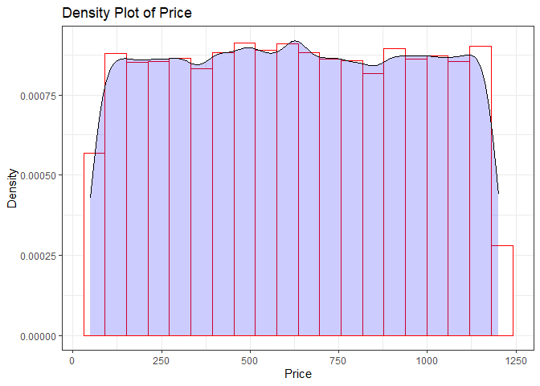
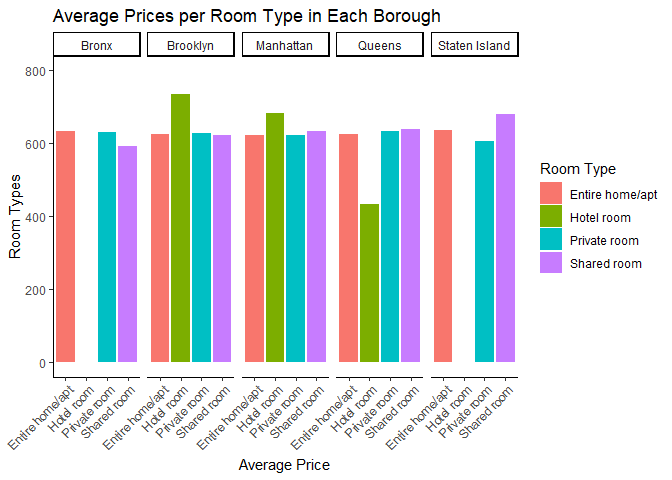
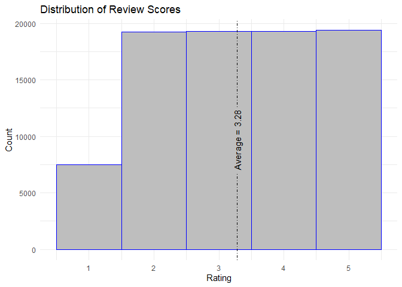
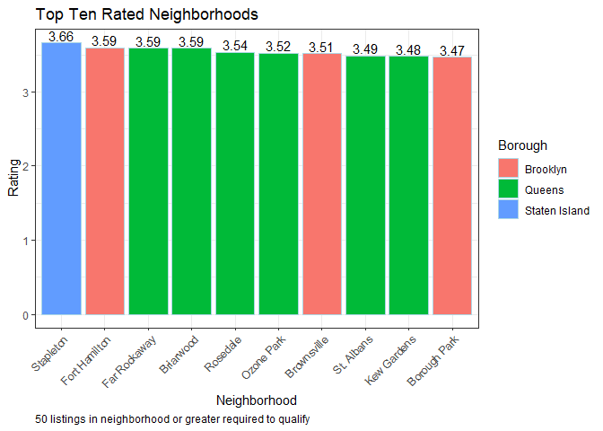
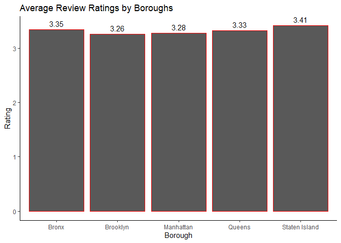
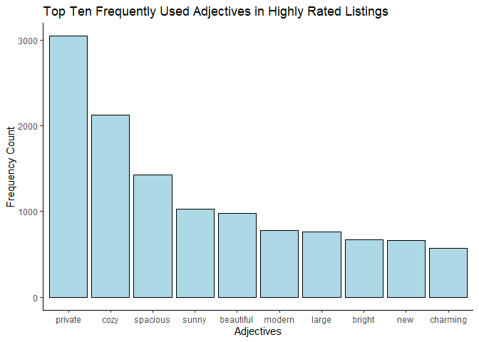

# Exploratory Data Analysis on Airbnb Data

## Introduction
Airbnb, short for "Air Bed and Breakfast", is an online marketplace allowing homeowners and property-owners to rent out their properties for homestays. Airbnb is in direct competiton with hotels and other home rental marketplaces. Currently Airbnb is in 191 countries with over 150 million hosts and has half a billion renters a year. In short, Airbnb is a successful company that thrives in tourist-driven cities near various attractions. 

## Data
The dataset we used was found here https://www.kaggle.com/datasets/arianazmoudeh/airbnbopendata, and uses data on Airbnb listings in NYC.

## Overview

### Required Packages
knitr\
tidyverse\
tidytext\
geomtextpath\
wordcloud\
RColorBrewer\
tm

### Data Understanding
The dataset used had a total of 102,599 rows/observations and 26 columns. In terms of missing data, we had 190,770 missing values/cells. In total, **7.15%** of our data set was missing. 

Dictionary of columns in data:

| Column | Description |
| ----- | ----- |
| id | Unique identifier |
| name | Name/description used on Airbnb listing |
| host_id | Host's identifier |
| host_identified_verified | Confirms if the host is a verified host |
| host_name | Name of the host |
| neighbourhood_group | Borough |
| neighbourhood |Neighbourhood of the borough |
| lat | Latitude |
| long | Longitude |
| country | Country |
| country_code | Country_code| 
| instant_bookable | T/F if listing can be booked immediadely |
| cancellation_policy | Flexibility of cancellation |
| room_type | type of listing (home/room/hotel) |
| Construction year | Year it was built |
| Price | Rental price |
| service_fee | Airbnb profit |
| minimum_nights | Minimum amount of stay |
| number_of_reviews | Amount of reviews on Airbnb |
| last_review | Date of last review |
| reviews_per_month | Average number of reviews per month |
| review_rate_number | Total average of reviews |
| calculated_host_listings_count | Amount of guests.
| availability 365 | number of days the property is available in the year |
| house_rules | Rules for the guests |

### Data Cleaning
Overall, the dataset was disorganized and fairly messy, therefore we carried out:

1) Changed all column names to consistent names (lowercase and seperated with an underscore between words).
2) Removed columns that had too many missing values (threshold we used was 50% missing data).
3) Fixed mispelt neighborhood group names (ex. brookln to Brooklyn).
4) removed observations with missing values for neighborhood groups.
5) removed observations with missing values for neighborhoods.
6) changed price to a numeric.
7) imputed missing prices with the average price for listings within the respective neighborhood group.
8) For remaining missing numeric values, we removed them all.

Ultimately, we are now left with 84,727 observations and 20 variables.

### Data Analysis

Looking at the distribution of prices, we can see that the average cost of an Airbnb in NYC per night came out to be $626.16 across all 5 boroughs. When plotted as a bar graph, we can see the average cost per night is evenly distributed. 

To split it up by boroughs :

| Borough	| Listings | Average Price |
| --- | --- | --- |
| Brooklyn | 35154	| $627.54|
| Manhattan |	35128	| $623.18 |
| Queens |	11301	| $630.56 |
| Bronx	| 2310	| $630.22 |
| Staten Island	| 834 |	$622.47 |

We can see that Brooklyn and Manhattan are the main hotspots for airbnb listings, with the two boroughs accounting for 41.49% and 41.47% of the total listings, respectively. Queens and the Bronx both are the highest costing boroughs, however, there is not significant average price difference between the 5 boroughs.

Next we broke down the average prices in each borough, by room type. In the data set there are 4 different possible room types consisting of :

| Room Type | Listing |
| --- | --- |
| Entire Home / Apartment | 44837 | 
| Hotel Room | 114 |
| Private Room | 38090 |
| Shared Room | 1686 |

In the bar chart above, we can see that in Bronx there were no listings for hotel rooms and neither was there for Staten Island, which makes sense as hotel rooms were scarce with only 114 total listings (.13%). For Brooklyn and Manhattan we can see that hotel rooms were clearly more expensive than other room types in their respective boroughs, however, in Queens, hotel rooms were much cheaper. Entire homes/apartments were very consistent with their pricing across all 5 boroughs.

Next we took a look at the ratings that the hosts were given.

The average rating came out to be 3.28 for all listings. The rating scores were distributed with around 20,000 entries for scores of 2-4 and less than 10,000 entries for a score of 1.

Analyzing the review ratings to see if neighborhoods skewed the scores, took the average ratings for neighborhoods. However once we ordered the review ratings, we limited our entries to neighborhoods that had over 50 listings as a way to combat skews from lack of sufficient data (i.e. neighbourhoods that had 1 listing that scored a 5). Therefore, we viewed only the neighborhoods that hosted 50 times.

We can see that the highest scoring neighbourhood was Stapleton, Staten Island with an average score of 3.66. Queens had 6 of the top 10 neighborhood ratings in our findings with 4 of them landing in the top 6. Brooklyn had 3 as well in the top 10 and no neighborhoods in the Bronx or Manhattan landed in the top 10 rated neighborhoods. This could however, be due to the lack of having over 50 listings in the those neighborhoods. Therefore, we viewed the ratings by boroughs as a whole.

Looking at the average scores per borough, we can see that Staten Island was rated the highest with 3.41 and Brooklyn came in last with a score of 3.26. However, it is important to note that Staten Island only had 834 total listings (0.98%).

### WordCloud

Lastly, we took a look at the listings rated 4 or 5 stars. In order to find similarities in those listings, we looked at the different adjectives that were used in the names of those listings, for example "Cozy 2 Bedroom Apartment", we would add a frequency word to the word cozy. After finding the different adjectives used and discarding all nouns and other words, we created a wordcloud and frequency bar graph.

In the frequency table we can see that the best rated listings used 'private', 'cozy' and 'spacious' the most, giving us more insight on what a customer valued the most and what words impacted the given rating the most. 

